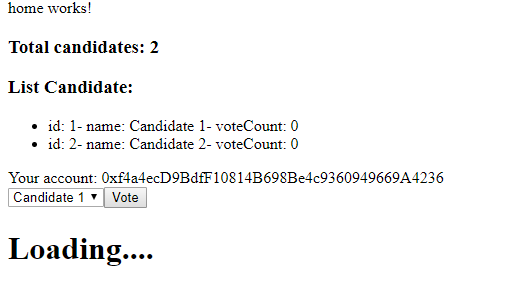

# Election-angular-rinkedby-test
Build solidity with Angular front end, metamask and INFURA, using web3 on Rinkedby Test net

# Election Angular Solidity
- This is demo how to build an contract by solidity on ethereum renkedby Test net.

## Precondition
- User Chome and install [MetaMask](https://metamask.io/) on Chrome Web Store, resgister account and choose RinkedbyTestNet. 

- Register [InFura](http://infura.io/) account to get the link (will use in RunStep).

## RunStep:
- Open **Window PowerSell** on Win 10 (if you have not it, you can modify directly ` process.env.PASSWORD` and `process.env.INFURA_LINK` in file **deploy.js** inside **src/app/ethereum** folder ) and go to root project.
- Run `npm install` first.
- Run `$env:PASSWORD="your_password"` and run `$env:INFURA_LINK="your_link_inifura"`
- Then run `npm run build-eth`, wait until **Deploy completed!!!**! And click `Ctrl+C` many times to stop process.
- Then run `ng serve --open` to open your angular front-end web app.

## Step to test on front-end
- After the project run on `localhost:4200` you will see some data gotten from server 

- Then you can choose candidate and click **vote** button. Then you will see the metamask Popup, click **submit** 

- Wait a moment and see data will reload with vote increase 1.

- Click on metamask icon on chrome and you will see history or something like this.

- Enjoy.

## Build (optional)
You can only compile or build contract by following command:
- Run `npm run compile-eth` to **Compile** Contract.
- Run `npm run deploy-eth` to **Deploy** our Contract.
- Run `npm run build-eth` to **Compile and Deploy** our Contract.
- Run `ng build` to build the project. The build artifacts will be stored in the `dist/` directory. Use the `--prod` flag for a production build.

## Reference
- Internet
- Angular.io
